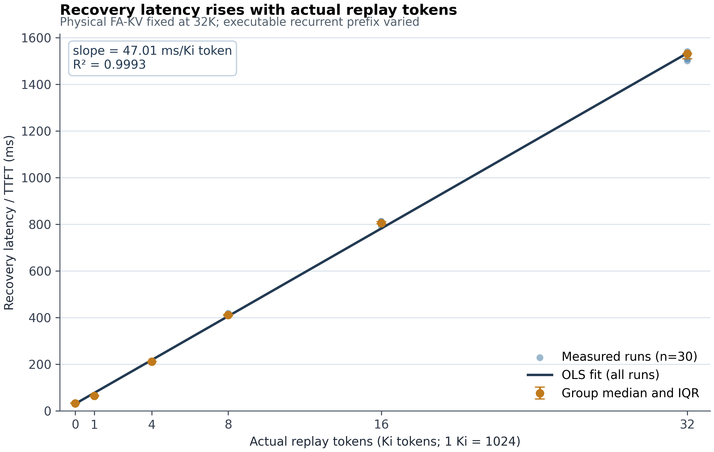

# FlowState Motivation WP2：Replay Cost Characterization

## 结论摘要

在 Qwen3.5-9B、SGLang v0.5.17、单张 H100 PCIe、concurrency=1 下，保持 physical FA-KV hit 恒为 32768 tokens，仅把 executable recurrent prefix 从 32768 缩短到 0，Recovery Latency（服务端 TTFT）从 **32.374 ms** 增至 **1531.882 ms**（各组中位数，n=5）。

30 个正式 measured runs 全部通过 runtime 硬门。对所有 raw runs 做描述性 OLS：

```text
RecoveryLatency_ms = 29.727 + 0.0459129 × ActualReplayTokens
                   = 29.727 + 47.015 × ActualReplayKiTokens

R²   = 0.999282
RMSE = 14.007 ms
```

因此，在本实验范围内，**actual replay token count 是非常好的 recovery-cost proxy**。这应理解为当前硬件、模型和 kernel 路径上的描述性近似，而不是跨系统的严格线性定律。



## 核心数据

本报告以组中位数作为主结果，IQR 表示 25%–75% 分位；每档 5 个有效 runs。

| Actual replay | Recovery / TTFT median (ms) | IQR (ms) | Min–max (ms) | 相对 0K 增量 (ms) | Request E2E median (ms) |
|---:|---:|---:|---:|---:|---:|
| 0 | **32.374** | 32.198–33.043 | 31.447–33.414 | 0.000 | 32.378 |
| 1K (1024) | **64.177** | 64.090–64.764 | 63.984–65.257 | 31.803 | 64.180 |
| 4K (4096) | **211.103** | 210.714–211.214 | 207.605–213.555 | 178.729 | 211.106 |
| 8K (8192) | **410.963** | 407.621–412.916 | 406.574–417.894 | 378.589 | 410.967 |
| 16K (16384) | **804.865** | 802.427–811.004 | 791.176–812.372 | 772.491 | 804.869 |
| 32K (32768) | **1531.882** | 1509.123–1532.207 | 1500.624–1540.731 | 1499.508 | 1531.885 |

这里的 `1K` 按实验档位定义为 1024 tokens。完整逐 run 数据见 [`raw_runs.csv`](raw_runs.csv)，组统计见 [`replay_cost.csv`](replay_cost.csv)。

## 8K gate

正式 sweep 前，8K case 的 runtime 证据为：

```text
target cached prefix       = 32768
FA-KV physical hit         = 32768
executable recurrent prefix= 24576
actual replay              = 8192
scheduled EXTEND           = 8193  # 8192 replay + 1 new query token
recovery / TTFT             = 401.641 ms
request E2E                 = 401.644 ms
```

深 checkpoint 在压力前已被真实使用：`EXT` 的 `full_kv_hit=exec_prefix=32768`。压力阶段随后记录到 recurrent `mamba_evict ... fa_kept=True`，而 measured request 降至 `exec_prefix=24576` 并真实执行 8192-token replay。gate 有效但不计入 30 个 sweep samples，逐字段结果见 [`gate_validation.csv`](gate_validation.csv)。

第一次冷 gate 也通过相同的 32768/24576/8192 结构门，但 TTFT 为 590.489 ms；它发生在该长 replay shape 的首次使用阶段，与 warm-state/JIT/clock/cache 等一次性效应一致，但具体来源未拆分、未验证。该点已连同不平衡顺序 pilot 明确排除；正式 gate 和 sweep 则刻画 warmed steady-state。原始记录仍保留，未选择性删除。

## 方法与指标口径

### 环境

```text
Model:       Qwen3.5-9B
Runtime:     SGLang v0.5.17, source 29481685462732237d80d86076d6563e1f658102
Container:   lmsysorg/sglang:v0.5.17-cu129-runtime
GPU:         1 × NVIDIA H100 PCIe (device 1)
Context:     45056
Mamba pool:  max_mamba_cache_size=16, extra_buffer
Scheduling:  disable_overlap_schedule, concurrency=1
HiCache:     disabled
Output:      1 greedy token, ignore_eos=true
```

### 精确 gap 构造

固定可缓存 target prefix `F=32768`，measured prompt 为该 prefix 加 1 个全新 query token，即 `N=32769`。这样 SGLang 的 `input_len−1` prefix-match 上限恰好允许 physical hit 达到 32768，避免原 32768-token请求产生 32767/32704 的尾部对齐残差。

对目标 replay `G`，保留浅 checkpoint `B=F−G`：

| G | B |
|---:|---:|
| 0 | 32768 |
| 1024 | 31744 |
| 4096 | 28672 |
| 8192 | 24576 |
| 16384 | 16384 |
| 32768 | 0 |

每个 trial 都同步 `POST /flush_cache?timeout=60`，使用独立 `extra_key`，随后复用已经验证过的 `S1 → R1 → EXT → 24 fillers → MEASURE` 方法：

1. 建立需要保留的 `B` checkpoint；
2. 建立并实际使用 32768 深 checkpoint；
3. 用独立尾部使深 checkpoint 所在节点 internal；
4. 用 24 个分支制造 recurrent pool 压力，同时反复刷新 `B`；
5. measured request 访问相同 32K prefix 加一个新 token。

32K 组没有目标路径上的浅 checkpoint，使用独立 16K filler base 产生 recurrent 压力并控制 Full-KV 占用。0K 组反复刷新完整 32K checkpoint。系统会在一次 replay 后 self-heal，因此每个 measured run 前都完整 flush 并重建 gap。

同一 repetition 内六档使用相同 target token 内容；五个 repetitions 使用不同内容。档位顺序采用一个随机基序列的五次循环移位，每档占据五个不同的 block position，降低时间漂移与 replay size 的相关性。先前不平衡顺序数据只作为 pilot 保留，不进入正式 CSV 或拟合。

### 指标定义

- `actual_replay_tokens = max(0, min(extend_end, fa_kv_hit) − extend_start)`。它只计算已经有 physical FA-KV、但因 recurrent checkpoint 不可执行而重算的区间。
- `actual_extend_tokens = actual_replay_tokens + 1`；额外 1 token 是 measured prompt 的新 query token，不算 replay。
- `recovery_latency_ms` 是 SGLang `APIServerReqTimeStats` 从 TokenizerManager 建立请求状态到收到并处理首批输出的 server-internal TTFT。它排除此前的 FastAPI JSON 解析，不是流式 HTTP first-byte latency；它包含调度/cache match、COW 或 clear、EXTEND/replay、采样同步与进程间管线开销。
- `request_e2e_latency_ms` 是服务端请求完成延迟。因为输出只有 1 token，E2E 与 TTFT 的差仅 2.12–4.42 µs。
- 现有 runtime 无法可靠拆出独立的 `restore_latency_ms` 和 `replay_latency_ms`，本报告没有猜测或伪造该拆分。

## Runtime 数据质量门

正式 30/30 runs 同时满足：

```text
flush HTTP 200
FA-KV physical hit       = 32768
executable prefix        = 32768 - expected_replay
actual replay            = expected_replay
scheduled EXTEND         = expected_replay + 1
meta.cached_tokens       = executable prefix
completion tokens        = 1
num_retractions          = 0
每个 measured RID 恰有 1 条 match / extend / timing probe
无 runtime error / OOM / multi-request batch
```

正式日志从最后一次 gate flush 开始独立提取到 [`server_formal.log`](server_formal.log)，避免与同名 pilot RID 混用。正式 segment 共记录 455 次 recurrent eviction，全部明确 `fa_kept=True`；每个 pressure window 有 13–14 次。

## 线性与稳健性

- 所有 30 个 raw runs：**47.015 ms/Ki token，R²=0.999282**。
- 六个 group medians：47.287 ms/Ki token，R²=0.999579。
- repetition fixed-effect：47.015 ms/Ki token，within-R²=0.999328。
- 同时控制 repetition 和 block position：47.009 ms/Ki token；block-position 系数仅 −0.342 ms/position。
- 五个 repetition 独立斜率为 46.404–47.523 ms/Ki token。

因此结论不是由某一个 repetition 或组内运行顺序驱动。线性模型是很强的工程近似，但小幅系统残差仍存在，不能把 `R²≈1` 解读成跨 shape、硬件和并发度不变的物理定律。

## 限制与未验证项

- 结果仅覆盖 Qwen3.5-9B、SGLang v0.5.17、H100 PCIe、concurrency=1、output=1 的 warmed steady-state。
- 未做 concurrency sweep、其他 context length、其他模型/GPU、自然文本 workload 或 tail-latency 分布。
- 没有独立计时 restore/COW 与 replay kernel；TTFT 是诚实的 total recovery latency。
- 0K 基线仍包含 checkpoint COW/restore、1 个新 token 和固定管线开销；32K 无 checkpoint 时走 clear 路径。因此斜率是端到端描述性 proxy，不应误写成纯 replay kernel throughput。
- 第一次冷 shape 的 gate 明显更慢，说明冷启动/JIT 成本另有研究价值，但不属于本轮 steady-state sweep。
- 32K 组为避免 Full-KV pool 压力使用独立 filler base；虽 block/order 调整后斜率几乎不变，仍未做逐 run GPU 温度/时钟遥测。
- 本轮没有实现 FlowState，也没有做 policy、workflow/fork、int8、Host Offload 或并发实验。

## Artifacts

- [`raw_runs.csv`](raw_runs.csv) — 30 个正式 measured runs
- [`replay_cost.csv`](replay_cost.csv) — 六档组统计
- [`plot_replay_latency.png`](plot_replay_latency.png) / [`plot_replay_latency.pdf`](plot_replay_latency.pdf) — 主图
- [`fit_metrics.json`](fit_metrics.json) — raw、group-median、block-adjusted 拟合
- [`driver.py`](driver.py) / [`analyze.py`](analyze.py) — 可复现 driver 与分析
- [`server_formal.log`](server_formal.log) / [`driver_events.jsonl`](driver_events.jsonl) — 正式 runtime 证据
- [`recovery_timing.patch`](recovery_timing.patch) — 只读 TTFT 元数据探针
- [`../runtime_validation_gap_replay_20260819/instrumentation.patch`](../runtime_validation_gap_replay_20260819/instrumentation.patch) — 直接复用的既有 FSVAL gap/eviction 探针
- `pilot_unbalanced_*` — 被排除、但为审计保留的 pilot

## Q1–Q5

**Q1. 0/1K/4K/8K/16K/32K replay 的实际 latency 分别是多少？**

组中位 Recovery Latency 分别为 **32.374 / 64.177 / 211.103 / 410.963 / 804.865 / 1531.882 ms**（每档 n=5）。actual replay 在每个 run 中都精确等于 0/1024/4096/8192/16384/32768。

**Q2. Replay tokens 增加时，Recovery Latency 是否明显增加？**

是。相对 0K，1K/4K/8K/16K/32K 的中位增量分别为 **31.803 / 178.729 / 378.589 / 772.491 / 1499.508 ms**。

**Q3. Replay cost 是否近似线性？**

是，在本实验范围内高度近似线性：**47.015 ms/Ki token，R²=0.999282**。block fixed-effect 和逐 repetition 拟合给出几乎相同的斜率；但它是当前配置下的描述性工程模型，不是无条件的线性定律。

**Q4. 避免长 replay 是否比避免短 replay 更有价值？**

是，绝对收益明显更大。避免 32K replay 可减少约 **1.500 s** 的中位 recovery latency，避免 1K 只减少约 **31.8 ms**；近似恒定的每-token 边际成本会随 replay 长度累积。

**Q5. 结果是否能证明 missing recurrent checkpoint 会产生真实、值得优化的 recovery cost？**

能，在该系统配置与 tested range 内证据充分：physical FA-KV 始终完整命中 32K，深 recurrent checkpoint 在压力前可执行、逐出时 FA-KV 被保留，随后 runtime 真实调度 0–32K replay；恢复代价最高约 **1.53 s**，且随 actual replay 稳定增长。这证明缺失 recurrent checkpoint 的代价不是 accounting artifact，而是可观、值得优化的真实延迟。
