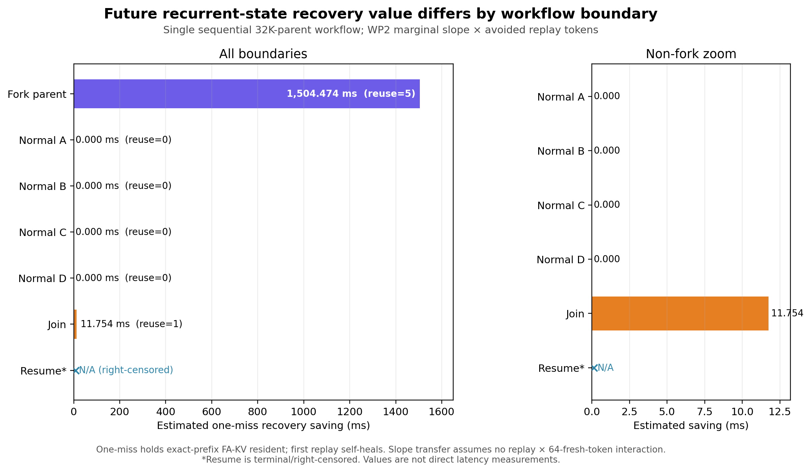

# FlowState Motivation WP3A：Workflow Boundary Value Characterization

## 结论摘要

这个单次、受控的 `32K Parent → 4 Children → Join → Parent Resume` workflow 成功产生了明显不同的 future recurrent-state value：

- `FORK_PARENT@32768` 被 runtime **实际选择 5 次**（4 个 child + Join）。若该 checkpoint 在第一次未来访问前缺失，机械 fallback 为 root，需 replay 32768 tokens；用 WP2 的边际斜率估算，单次缺失的 recovery penalty 约 **1504.474 ms**。
- 4 个 `NORMAL@32832` checkpoint 都被真实创建，但后续 **0 次**成为 executable recurrent prefix；其 branch output 虽被 Join 消费，其 recurrent state 不在 Join 的 token-prefix 路径上。因此它们在本 workflow horizon 内的 recovery value 为 **0**。
- `JOIN@33024` 被 Resume **实际选择 1 次**。若缺失，最近的同路径 fallback 是 `FORK_PARENT@32768`，增量 replay 为 256 tokens，估算 recovery penalty 约 **11.754 ms**。
- `RESUME@33088` 是观测窗口终点；只观察到 horizon 内 future consumer count 为 0，`future_reused/reuse_count/value` 均记为 **N/A（右删失）**，不能解释成低价值 negative。

所以，候选 checkpoint 的物理大小虽然相同，未来价值却从 0 到约 1.5 s 相差很大。这个结果支持把 workflow semantics 作为 checkpoint selection 的额外信息；它不是完整 policy 或跨 workload 的普遍定律。



## Controlled workflow

本轮只执行一个 workflow，所有请求严格串行、每次输出 1 个 greedy token：

```text
32K Parent prompt ──> FORK_PARENT checkpoint @32768
                         ├── Parent output + suffix A ──> NORMAL A @32832
                         ├── Parent output + suffix B ──> NORMAL B @32832
                         ├── Parent output + suffix C ──> NORMAL C @32832
                         ├── Parent output + suffix D ──> NORMAL D @32832
                         └── Parent output + Join payload(child A/B/C/D outputs)
                                                └── JOIN @33024
                                                        └── Join output + resume suffix
                                                                 └── RESUME @33088
```

这里的 Join 是诚实的 **application-level fan-in**：Join payload 在固定位置逐 token 嵌入四个真实 child output。SGLang radix tree 不会把四份 recurrent state 合并成一份；Join 的 executable state 沿共同 Parent prefix 前进。Resume 则把真实 Join output 放入输入，并从 Join checkpoint 继续。输入摘要重建验证 7/7 通过，`join_embeds_all_four_actual_child_outputs=true`，`resume_embeds_actual_join_output=true`。

`PENDING_RESUME` 作为 `FORK_PARENT` 和 `JOIN` 的语义角色记录在 trace 中，但没有复制成独立 CSV 行，避免对同一个物理 candidate 重复计数。本轮没有为了凑类型加入不自然的 TOOL。

## 真实 runtime 证据

`FA-KV hit` 和 `Executable prefix` 均来自复用的只读 `[FSVAL]` runtime probe，不是由 token 长度推测。所有 checkpoint insert 也在真实 extra-buffer path 中观察到。

| Request | Prompt tokens | FA-KV hit | Executable prefix | Physical-only gap | Scheduled EXTEND | Inserted checkpoint | Exclusive selected boundary |
|---|---:|---:|---:|---:|---:|---:|---|
| Parent | 32768 | 0 | 0 | 0 | 32768 | 32768 | ROOT |
| Child A | 32832 | 32768 | **32768** | 0 | 64 | 32832 | FORK_PARENT |
| Child B | 32832 | 32769 | **32768** | 1 | 64 | 32832 | FORK_PARENT |
| Child C | 32832 | 32769 | **32768** | 1 | 64 | 32832 | FORK_PARENT |
| Child D | 32832 | 32769 | **32768** | 1 | 64 | 32832 | FORK_PARENT |
| Join | 33024 | 32769 | **32768** | 1 | 256 | 33024 | FORK_PARENT |
| Parent Resume | 33088 | 33024 | **33024** | 0 | 64 | 33088 | JOIN |

Child B/C/D 和 Join 的 1-token `physical-only gap` 是已经存在 FA-KV、但 checkpoint 仍停在 32768 的 parent output token；它与本报告的 counterfactual missing-checkpoint replay distance 不是同一个指标。

硬门全部通过：

```text
cache flush:                       HTTP 200 + backend success log
requests / declared candidates:   7 / 7
runtime match/extend/insert:       each RID exactly 1 / 1 / 1
prefill batch sizes:               1,1,1,1,1,1,1
retractions:                       0
mamba evictions in run window:     0
runtime errors in run window:      0
input dependency reconstruction:   7/7
```

完整请求、依赖、runtime fields、exclusive reuse events 和 validation summary 在 [`workflow_trace.jsonl`](workflow_trace.jsonl)；逐候选结果在 [`boundary_events.csv`](boundary_events.csv)。原始 runtime 证据见 [`server_full.log`](server_full.log)，driver 原始事件见 [`driver_events.jsonl`](driver_events.jsonl)。

## Boundary future value

| Boundary | Type | Position | Raw future prefix matches | Exclusive recurrent reuse | First-miss replay distance | Single-miss avoided replay | Estimated saving |
|---|---|---:|---:|---:|---:|---:|---:|
| b_fork_parent | FORK_PARENT | 32768 | 6 | **5** | **32768** | **32768** | **1504.474 ms** |
| b_child_a_normal | NORMAL | 32832 | 0 | 0 | 0 | 0 | 0 ms |
| b_child_b_normal | NORMAL | 32832 | 0 | 0 | 0 | 0 | 0 ms |
| b_child_c_normal | NORMAL | 32832 | 0 | 0 | 0 | 0 | 0 ms |
| b_child_d_normal | NORMAL | 32832 | 0 | 0 | 0 | 0 | 0 ms |
| b_join | JOIN | 33024 | 1 | **1** | **256** | **256** | **11.754 ms** |
| b_resume | RESUME | 33088 | 0 | N/A | N/A | N/A | N/A（terminal/right-censored） |

Parent 的 raw prefix match 是 6，因为 Resume 也包含 Parent prefix；exclusive `reuse_count` 是 5，因为 Resume 实际选择了更深的 Join checkpoint。每个 future request 只归给一个已创建、内容 exact-prefix-match、且位置等于真实 `exec_prefix` 的最深 candidate，避免嵌套边界重复获益。

### 价值口径

对每个被实际选择的 candidate，analyzer 机械查找同一 consumer 路径上更浅、已经 ready 且真实 insert 的最近 checkpoint；找不到则使用 `ROOT@0`：

```text
replay_distance_tokens = candidate_position - nearest_shallower_checkpoint
estimated_recovery_saving_ms
    = 0.0459129 × single_miss_avoided_replay_tokens
```

这个 counterfactual **固定对应 exact-prefix FA-KV 仍在 device，只移除 recurrent/Mamba checkpoint**，与 WP2 的 replay 定义一致。若 FA-KV 与 recurrent state 一起被逐出，恢复路径和成本都会改变，不属于本轮估算范围。

只使用 WP2 slope，不加 intercept，因为这里估算的是两个 replay 长度之间的边际 latency difference。

这个 slope transfer 还有一个具体的适用性假设：WP2 在 `32K physical hit + 1 fresh token` 的请求上拟合；WP3A 的反事实比较则是在相同请求的有/无 checkpoint 两侧都保留 64 个 fresh tokens，即 Parent miss 近似 `32768 replay + 64 fresh`，Join miss 近似 `256 replay + 64 fresh`。因此 1504.474/11.754 ms 假设 replay 边际成本与这段较长 fresh suffix 可加、没有显著 interaction；本轮没有直接验证该假设。Join 的 256-token 点还低于 WP2 最小非零 1K 档，是未直接采样的低端线性模型预测，置信度低于 Parent 32K estimate。

Primary estimand 是 **concurrency=1 下的一次 checkpoint 缺失 episode**。WP2 已确认第一次 replay 会 self-heal，因此不能把 Parent 的 32768 tokens 无条件乘以 5 次 reuse。主结果是 Parent 32768 tokens / 1504.474 ms，Join 256 tokens / 11.754 ms；两个 candidate score 相加为 33024 tokens / 1516.228 ms，但这只是候选分数之和，不是本轮直接测得的 workflow latency。

CSV 另保留了明确命名的 `gross_if_independently_missing_each_reuse_*`：它描述“每次 reuse 前都再次缺失”的 repeated-eviction/no-retention 上界，Parent 为 163840 tokens / 7522.370 ms；**不作为主结论**。

## 环境与复现

```text
Model:       Qwen3.5-9B
Runtime:     SGLang v0.5.17
Source:      29481685462732237d80d86076d6563e1f658102
Image:       lmsysorg/sglang:v0.5.17-cu129-runtime
GPU:         1 × NVIDIA H100 PCIe (device 1)
Context:     45056
Mamba pool:  max_mamba_cache_size=16, extra_buffer
Scheduling:  disable_overlap_schedule, concurrency=1
HiCache:     disabled
Output:      1 greedy token, ignore_eos=true
```

复现代码为 [`driver.py`](driver.py)，验证、CSV 和绘图代码为 [`analyze.py`](analyze.py)。runtime 只复用了上一轮已经验证的 [`../runtime_validation_gap_replay_20260819/instrumentation.patch`](../runtime_validation_gap_replay_20260819/instrumentation.patch)，没有改变 cache 语义。immutable image、container、完整命令与输入/输出 SHA256 见 [`metadata.json`](metadata.json)。

## 解释边界与未验证项

- 本轮真实测了 checkpoint creation、future selection 和 prefix/replay structure；**没有主动逐出 candidate 再测真实 recovery latency**。所有 saving 都是使用 WP2 slope 的 counterfactual estimate。
- 反事实只移除 recurrent checkpoint、保持 exact-prefix FA-KV 驻留；不覆盖二者共同 eviction。
- WP2 slope 来自 `replay + 1 fresh token`，迁移到本轮 `replay + 64 fresh tokens` 假设两者边际成本可加且无 interaction；Join 的 256-token estimate 还低于 WP2 最小非零 1K 档。
- 这是一个 workflow、一个拓扑和一个观察窗口；boundary type 与 DAG position 在这个最小例中不能完全解耦，不能据此给出跨 workflow 的 reuse probability。
- 四个 NORMAL 是有完整未来观察机会却未被选择的真实 zero；terminal RESUME 是右删失，不属于 negative evidence。
- Join 是 application-level output aggregation，不是多个 recurrent tensors 的原生 merge。
- `reuse_count` 证明的是 exact-prefix、同 token position 的 **logical boundary-equivalent recurrent state** 被选择；当前 probe 没有记录每次 match 的 node/slot ID，因此不声称 5 次选择始终引用同一个物理 slot 实例。
- TOOL 未包含；没有做 context、branch-width、concurrency 或 policy sweep。

## Q1–Q5

### Q1. Controlled Agent Workflow 是否成功表现出 Fork → Children → Join/Resume 的状态复用关系？

**是。** 四个 child 和 Join 的真实 `exec_prefix` 都是 Parent checkpoint 32768；Join 输入精确包含四个 child 输出；Resume 输入精确包含 Join 输出，并真实选择 Join checkpoint 33024。需要限定的是：Join 是 application-level fan-in，四个 sibling recurrent state 没有被合并。

### Q2. 不同 boundary type 的 future reuse / replay-saving value 是否明显不同？

**是，在这个 controlled workflow 内非常明显。** FORK_PARENT 被 exclusive reuse 5 次，single-miss avoided replay 为 32768 tokens；JOIN 被 reuse 1 次，避免 256 tokens；4 个有完整未来观察窗口的 NORMAL 都是 0 次、0 token。RESUME 因 terminal/right-censored 不参与高低判断。

### Q3. Fork Parent 是否属于明显高价值 recurrent checkpoint candidate？为什么？

**是。** 它是 4 个 child 和 Join 的共同 executable ancestor，真实选择次数最多；最近 fallback 是 root，缺失会触发最长的 32K replay。WP2 模型给出的 single-miss penalty 约 1504.474 ms，是 Join candidate 的 **128×**。

### Q4. 普通 Prompt/Normal Boundary 是否存在“创建了但未来没有恢复价值”的情况？

**是。** 4 个 child endpoint 都有真实 `insert_ckpt@32832`，但后续没有任何请求以它们作为 executable recurrent prefix。它们的输出在语义上被 Join 使用，checkpoint state 却因 sibling 路径不兼容而没有恢复价值；这正是“语义数据被使用”和“recurrent state 可复用”之间的区别。

### Q5. 这些结果是否足以支持：Workflow semantics 可以作为 recurrent checkpoint selection 的额外信息？

**足以作为 controlled existence proof，支持“可以作为额外信息”；不足以证明完整或最优 policy。** 相同大小的候选仅因在 workflow DAG 中的角色与未来路径不同，就表现出 5/1/0 的 exclusive reuse 和 32768/256/0 的 first-miss replay saving。要泛化到概率模型或其他 workflow，仍需额外 workload 与直接 eviction ablation；本轮不继续进入该范围。
