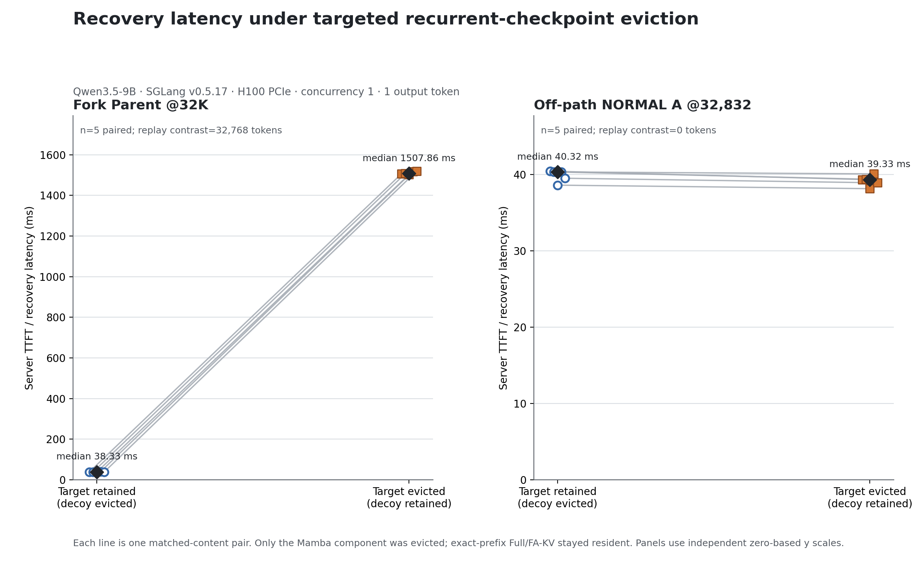

# FlowState WP3A：Fork-vs-NORMAL Direct Eviction Causal Validation

## Technical summary

**Verdict: PASS.** 在同一 Qwen3.5-9B / SGLang v0.5.17 / H100 PCIe controlled workflow 中，本轮对 exact radix node 做了 scheduler-idle、Mamba-component-only 的直接 intervention；对应 Full/FA-KV 保持 resident。每个 arm 都独立 `flush → rebuild`，并对称删除一个 49.125 MiB recurrent slot：保留组删除 off-path decoy，删除组删除 target，因而 allocator occupancy 与 eviction 管理动作配平。

- **FORK_PARENT@32768**：保留时 `FA/exec/replay = 32768/32768/0`，server TTFT 中位数 **38.332 ms**；直接删除后为 `32768/0/32768`，TTFT 中位数 **1507.858 ms**。5 个 paired effects 的均值为 **+1472.748 ms**（t-based 95% CI **[1464.412, 1481.084] ms**），中位数 **+1469.627 ms**，5/5 为正。
- **NORMAL A@32832 control**：保留和删除后 Join 都是 `FA/exec/replay = 32769/32768/1`；target 删除没有改变 executable prefix 或 replay。TTFT 中位数分别为 **40.318 / 39.330 ms**，paired mean difference **-0.670 ms**（95% CI **[-1.104, -0.236] ms**）。

## Fork Parent deletion causes a real 32K replay

每个 Fork pair 使用相同 token content、相同 measured input hash 和相同 build signature。目标 Parent checkpoint 先通过一个不进入 measured path 的 sentinel 变为 internal node；decoy 也同样 internalize。两个 condition 都调用同一套 SGLang 原生 component lifecycle：Mamba tombstone、LRU detach/cascade、component-aware allocator free。

| Condition | FA-KV hit | Executable prefix | Actual replay | Scheduled EXTEND | Median TTFT |
|---|---:|---:|---:|---:|---:|
| Fork retained; decoy evicted | 32768 | 32768 | 0 | 64 | 38.332 ms |
| Fork evicted; decoy retained | 32768 | 0 | 32768 | 32832 | 1507.858 ms |

删除组的 Full hit 仍精确为 32768，但 executable prefix 降为 root@0；其中 32768 个已在 FA-KV 的 tokens 被真实重新执行，外加 64 个 fresh tokens。runtime 同时记录 `branching=32768`、forced track、duplicate Full-KV rows free，并在请求结束后重新观察到 Parent Mamba checkpoint，证明 first miss 后 self-heal。

WP2 slope 给出的外部预测是 `32768 × 0.0459129 = 1504.474 ms`。本轮 paired mean penalty 为 1472.748 ms，是预测的 **0.979×**，差 -31.726 ms；因此处于同一约 1.5 s 量级，但这里的值是直接测量，不要求与 slope 精确一致。

## Deleting off-path NORMAL A adds no Join replay or positive recovery penalty

NORMAL A 先在真实 child request 中创建为 checkpoint@32832，再用一个 setup descendant 变为 internal node。之后保留组删除 decoy，删除组只删除 NORMAL A；两组都保留 Parent@32768。完全相同的 Join prompt 在两组都只选择 Parent：

这里的 Join 是 application-level fan-in：A/B/C/D 的真实 output token 被序列化嵌入新的 Parent-lineage prompt；SGLang 并没有合并四个 sibling recurrent states。因此本节检验的是 off-path NORMAL A 对该 Join consumer 的边际贡献，而不是 native multi-state merge。

| Condition | NORMAL A after control | Parent after control | Join FA hit | Join exec | Join replay | Median TTFT |
|---|---|---|---:|---:|---:|---:|
| NORMAL retained; decoy evicted | present | present | 32769 | 32768 | 1 | 40.318 ms |
| NORMAL evicted; decoy retained | absent | present | 32769 | 32768 | 1 | 39.330 ms |

这里的 1-token replay 是 Parent output 已有 physical FA-KV、但可执行 recurrent checkpoint 仍停在 32768 的共同 gap；它在两个 condition 完全相同，因此 NORMAL eviction 引入的 **增量 replay 为 0**。Join 完成后，被删除的 NORMAL A 仍 absent，进一步证明 Join 没有沿它的状态路径执行。

TTFT 的 5 个 paired differences 全部是小幅负值，均值为 **-0.670 ms**。本轮未预先定义 equivalence margin，因此不把它表述为统计意义上的“完全相等”；严格结论是没有额外 replay，也没有观察到正向 recovery penalty。

## Causal controls and validation

正式数据为 2 个 targets × 2 conditions × 5 repetitions = **20/20 valid episodes**；每个 episode 都重新 flush/rebuild，warmup 4 个 shape 另行排除。有效性完全由结构和 runtime 日志决定，latency 大小不参与筛选。

每次 intervention 均验证：

- target 与 decoy 在 intervention 前都有一个 Mamba slot，且 target node 是 internal、无 lock/session ref；
- 被控节点 `Mamba present → absent`，Mamba allocator available `+1`、evictable `-1`；
- `tracker[MAMBA]=1`、`tracker[FULL]=0`、host free=0；
- exact path 与全树 Full digest、Full allocator、radix structure 全部不变；全树 Mamba diff 只有被控 node；
- 每个 case 恰好一个 `mamba_evict ... freed=1 fa_kept=True`，无额外 eviction；
- measured RID 各恰好一条 match/extend/timing/insert，所有 prefill batch size=1，无 retraction、OOM 或 runtime error；
- 每个 pair 的 measured input、build signature 和 greedy output hash 一致，control 后 pool occupancy 一致。

逐 episode 的 runtime、control 和 latency 字段见 [`raw_runs.csv`](raw_runs.csv)；逐 pair effect 见 [`paired_effects.csv`](paired_effects.csv)；两项汇总见 [`summary.csv`](summary.csv)。完整 scheduler/control 证据保存在 [`server_full.log`](server_full.log) 与 [`driver_events.jsonl`](driver_events.jsonl)；环境、命令、输入 patch 与 SHA-256 manifest 见 [`metadata.json`](metadata.json)。

## Scope and limitations

- 这是 direct exact-target ablation，而不是自然 LRU policy benchmark。为了只移除 recurrent component、保留 Full，实验先把 target/decoy internalize；setup sentinel/descendant 不属于 measured workflow edge。
- `recovery_latency` 是服务端 first-token latency：包含 recurrent COW/replay、prompt EXTEND 和到首 token 的正常执行；当前 instrumentation 不能可靠拆成纯 replay kernel time，因此不做伪拆分。
- 5 个 paired repetitions 支持这个 controlled setting 的局部因果结论；t interval 是小样本描述性不确定性，不外推到生产 workload、并发、其他模型或 joint FA-KV eviction。
- Fork 两侧都含 64 fresh tokens；WP2 calibration 使用 1 fresh token。直接结果不依赖 slope transfer，但两者数值比较仍受这个 workload 差异影响。
- NORMAL 结论只针对本 workflow horizon 与 Join consumer，不表示普通 boundary 永远无价值。
- NORMAL 的 TTFT 差为小幅负值；本轮没有预设 practical-equivalence margin，因此只对“无新增 replay / 无正向 recovery penalty”作结论，不声称 latency 统计等价。
- Join 是 branch outputs 的 token serialization，不是 sibling recurrent-state merge；本轮测量 consumer 是 Join，没有另行计时 Resume。
- 本轮没有实现 FlowState、selection policy 或 WP3B，也没有做任何 context/width/concurrency sweep。

## Q1–Q5

### Q1. 保留 FORK_PARENT 时，后续 consumer 的 exec_prefix / replay / latency 是多少？

**`exec_prefix=32768`，actual replay=0；server TTFT 中位数 38.332 ms**（n=5）。对应 FA-KV hit 也是 32768，scheduled EXTEND 只有 64 个 fresh tokens。

### Q2. 直接删除 FORK_PARENT recurrent checkpoint 后，是否真实触发长 replay？实际 replay tokens 和 latency penalty 是多少？

**是。** FA-KV hit 保持 32768，但 executable prefix 降到 0，真实 replay **32768 tokens**。删除组 TTFT 中位数 1507.858 ms；5 个 paired penalty 平均 **+1472.748 ms**、中位数 **+1469.627 ms**，范围 [1465.682, 1480.911] ms。

### Q3. 这个实测 penalty 是否与 WP2 的 ~1.5s 预测处于相同量级？

**是。** WP2 预测 1504.474 ms，本轮 paired mean 为 1472.748 ms（0.979× prediction）。两者都在约 1.5 s 量级；差异不被解释成模型失效，因为 fresh suffix 与实验实现并不完全相同。

### Q4. 直接删除一个 NORMAL checkpoint 后，是否对 Join/Resume 的 executable prefix、replay 和 latency 基本无影响？

**对本轮测量的 Join，恢复结构上是；latency 只能作有限结论。** 删除前后都 `exec_prefix=32768`、actual replay=1，结构上的增量 replay 为 0。TTFT paired mean difference 为 **-0.670 ms**（95% CI [-1.104, -0.236] ms），即没有观察到正向 penalty，且相对 Fork effect 很小；由于未预设 equivalence margin，不声称 TTFT 统计等价。本轮没有另外计时 Resume。

### Q5. 结果是否足以把 WP3A 从“estimated workflow value”升级为“directly measured causal evidence”？

**足以在这个 controlled setting 内升级。** 同一内容、同一 pool occupancy、同一 eviction lifecycle 下，唯一与 measured path 相关的差异是 target Mamba 是否存在：删除 Fork 直接造成 32K replay 与约 1.5 s penalty；删除 off-path NORMAL 不改变 executable prefix/replay。它仍是局部 causal evidence，不是完整 FlowState policy 或跨 workload 定律。
